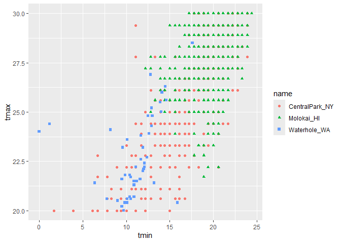

EDA
================
2025-10-02

make plots

``` r
weather_df |> 
    ggplot(aes(x = prcp)) + 
  geom_histogram()
```

    ## `stat_bin()` using `bins = 30`. Pick better value `binwidth`.

    ## Warning: Removed 15 rows containing non-finite outside the scale range
    ## (`stat_bin()`).

<!-- -->

check on extreme values

``` r
weather_df |> 
  filter(prcp>1000)
```

    ## # A tibble: 3 × 7
    ##   name           id          date        prcp  tmax  tmin month     
    ##   <chr>          <chr>       <date>     <dbl> <dbl> <dbl> <date>    
    ## 1 CentralPark_NY USW00094728 2021-08-21  1130  27.8  22.8 2021-08-01
    ## 2 CentralPark_NY USW00094728 2021-09-01  1811  25.6  17.2 2021-09-01
    ## 3 Molokai_HI     USW00022534 2022-12-18  1120  23.3  18.9 2022-12-01

look at data again

``` r
weather_df |> 
  filter(tmax>=20, tmax <=30) |> 
  ggplot(aes(x=tmin, y=tmax, color=name, shape = name))+
  geom_point()
```

<!-- --> \## add groups

``` r
weather_df |> 
  group_by(month)
```

    ## # A tibble: 2,190 × 7
    ## # Groups:   month [24]
    ##    name           id          date        prcp  tmax  tmin month     
    ##    <chr>          <chr>       <date>     <dbl> <dbl> <dbl> <date>    
    ##  1 CentralPark_NY USW00094728 2021-01-01   157   4.4   0.6 2021-01-01
    ##  2 CentralPark_NY USW00094728 2021-01-02    13  10.6   2.2 2021-01-01
    ##  3 CentralPark_NY USW00094728 2021-01-03    56   3.3   1.1 2021-01-01
    ##  4 CentralPark_NY USW00094728 2021-01-04     5   6.1   1.7 2021-01-01
    ##  5 CentralPark_NY USW00094728 2021-01-05     0   5.6   2.2 2021-01-01
    ##  6 CentralPark_NY USW00094728 2021-01-06     0   5     1.1 2021-01-01
    ##  7 CentralPark_NY USW00094728 2021-01-07     0   5    -1   2021-01-01
    ##  8 CentralPark_NY USW00094728 2021-01-08     0   2.8  -2.7 2021-01-01
    ##  9 CentralPark_NY USW00094728 2021-01-09     0   2.8  -4.3 2021-01-01
    ## 10 CentralPark_NY USW00094728 2021-01-10     0   5    -1.6 2021-01-01
    ## # ℹ 2,180 more rows

Group and count things

``` r
weather_df |> 
  group_by(name) |> 
  summarize(
    n=n()
  )
```

    ## # A tibble: 3 × 2
    ##   name               n
    ##   <chr>          <int>
    ## 1 CentralPark_NY   730
    ## 2 Molokai_HI       730
    ## 3 Waterhole_WA     730

``` r
weather_df |> 
  group_by(month) |> 
  summarize(
    n=n()
  )
```

    ## # A tibble: 24 × 2
    ##    month          n
    ##    <date>     <int>
    ##  1 2021-01-01    93
    ##  2 2021-02-01    84
    ##  3 2021-03-01    93
    ##  4 2021-04-01    90
    ##  5 2021-05-01    93
    ##  6 2021-06-01    90
    ##  7 2021-07-01    93
    ##  8 2021-08-01    93
    ##  9 2021-09-01    90
    ## 10 2021-10-01    93
    ## # ℹ 14 more rows

``` r
weather_df |> 
  group_by(month, name) |> 
  summarize(
    n=n()
  )
```

    ## `summarise()` has grouped output by 'month'. You can override using the
    ## `.groups` argument.

    ## # A tibble: 72 × 3
    ## # Groups:   month [24]
    ##    month      name               n
    ##    <date>     <chr>          <int>
    ##  1 2021-01-01 CentralPark_NY    31
    ##  2 2021-01-01 Molokai_HI        31
    ##  3 2021-01-01 Waterhole_WA      31
    ##  4 2021-02-01 CentralPark_NY    28
    ##  5 2021-02-01 Molokai_HI        28
    ##  6 2021-02-01 Waterhole_WA      28
    ##  7 2021-03-01 CentralPark_NY    31
    ##  8 2021-03-01 Molokai_HI        31
    ##  9 2021-03-01 Waterhole_WA      31
    ## 10 2021-04-01 CentralPark_NY    30
    ## # ℹ 62 more rows

``` r
weather_df |> 
  group_by(month) |> 
  summarize(
    n=n_distinct(date)
  )
```

    ## # A tibble: 24 × 2
    ##    month          n
    ##    <date>     <int>
    ##  1 2021-01-01    31
    ##  2 2021-02-01    28
    ##  3 2021-03-01    31
    ##  4 2021-04-01    30
    ##  5 2021-05-01    31
    ##  6 2021-06-01    30
    ##  7 2021-07-01    31
    ##  8 2021-08-01    31
    ##  9 2021-09-01    30
    ## 10 2021-10-01    31
    ## # ℹ 14 more rows

You can count directly

``` r
weather_df |> 
  count(name)
```

    ## # A tibble: 3 × 2
    ##   name               n
    ##   <chr>          <int>
    ## 1 CentralPark_NY   730
    ## 2 Molokai_HI       730
    ## 3 Waterhole_WA     730
