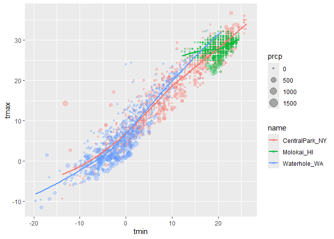
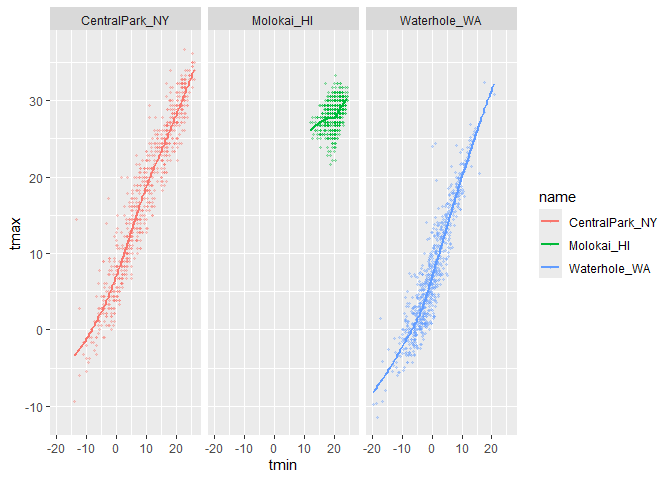
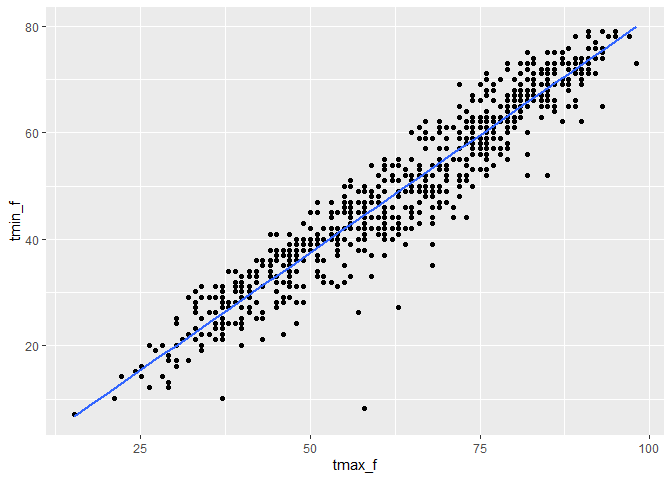
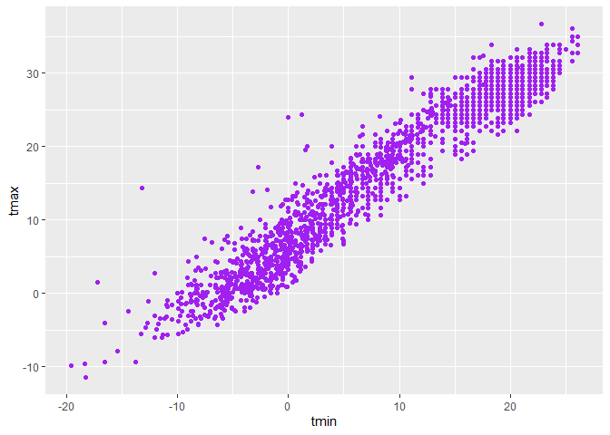
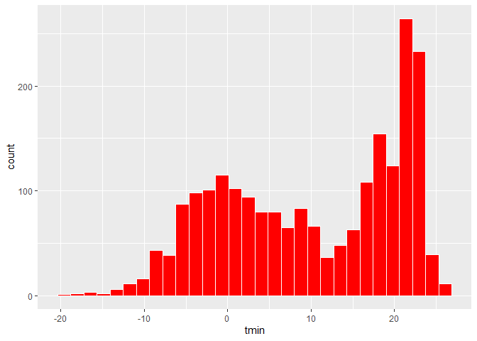
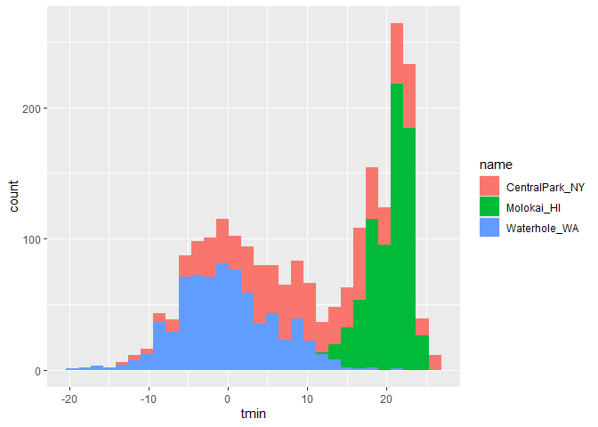
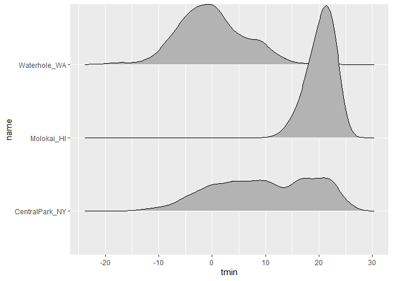
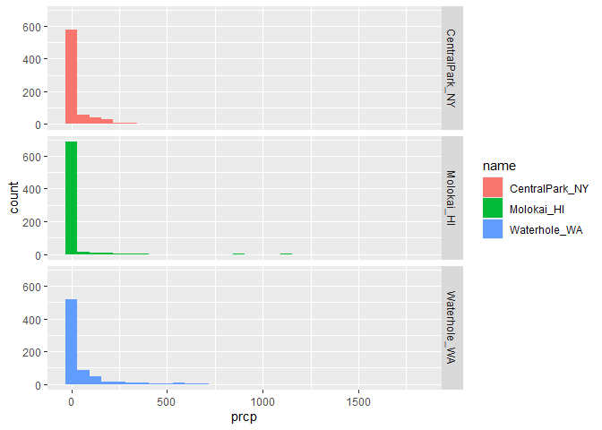
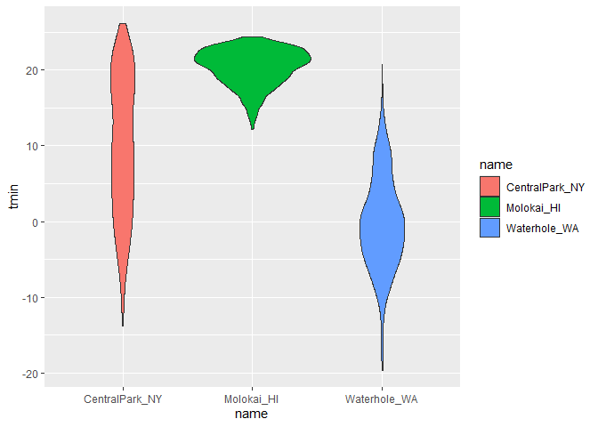

viz
================
2025-09-25

\*\*run this code devtools::install_github(“p8105/p8105.datasets”)

``` r
data("weather_df")
```

``` r
ggplot(data=weather_df, mapping= aes(x=tmin, y=tmax))+
  geom_point()
```

    ## Warning: Removed 17 rows containing missing values or values outside the scale range
    ## (`geom_point()`).

<!-- -->

``` r
ggp_weather_scatterplot=
  weather_df %>% 
  ggplot(aes(x=tmin, y=tmax)) +
  geom_point()
```

## check some rows are missing

``` r
weather_df %>% 
  filter(is.na(tmax))
```

    ## # A tibble: 17 × 6
    ##    name         id          date        prcp  tmax  tmin
    ##    <chr>        <chr>       <date>     <dbl> <dbl> <dbl>
    ##  1 Molokai_HI   USW00022534 2022-05-31    NA    NA    NA
    ##  2 Waterhole_WA USS0023B17S 2021-03-09    NA    NA    NA
    ##  3 Waterhole_WA USS0023B17S 2021-12-07    51    NA    NA
    ##  4 Waterhole_WA USS0023B17S 2021-12-31     0    NA    NA
    ##  5 Waterhole_WA USS0023B17S 2022-02-03     0    NA    NA
    ##  6 Waterhole_WA USS0023B17S 2022-08-09    NA    NA    NA
    ##  7 Waterhole_WA USS0023B17S 2022-08-10    NA    NA    NA
    ##  8 Waterhole_WA USS0023B17S 2022-08-11    NA    NA    NA
    ##  9 Waterhole_WA USS0023B17S 2022-08-12    NA    NA    NA
    ## 10 Waterhole_WA USS0023B17S 2022-08-13    NA    NA    NA
    ## 11 Waterhole_WA USS0023B17S 2022-08-14    NA    NA    NA
    ## 12 Waterhole_WA USS0023B17S 2022-08-15    NA    NA    NA
    ## 13 Waterhole_WA USS0023B17S 2022-08-16    NA    NA    NA
    ## 14 Waterhole_WA USS0023B17S 2022-08-17    NA    NA    NA
    ## 15 Waterhole_WA USS0023B17S 2022-08-18    NA    NA    NA
    ## 16 Waterhole_WA USS0023B17S 2022-08-19    NA    NA    NA
    ## 17 Waterhole_WA USS0023B17S 2022-12-31    76    NA    NA

## fancier scatterplots

``` r
weather_df %>% 
  ggplot(aes(x=tmin, y=tmax, color=name))+
  geom_point(aes(color=name,size=prcp), alpha=0.3)+
  geom_smooth(se=FALSE)
```

    ## `geom_smooth()` using method = 'loess' and formula = 'y ~ x'

    ## Warning: Removed 17 rows containing non-finite outside the scale range
    ## (`stat_smooth()`).

    ## Warning: Removed 19 rows containing missing values or values outside the scale range
    ## (`geom_point()`).

<!-- --> \## use
facetting real quick

``` r
weather_df %>% 
  ggplot(aes(x=tmin, y=tmax, color=name))+
  geom_point(aes(color=name), alpha=0.3,size=0.8)+
  geom_smooth(se=FALSE)+
facet_grid(.~name)
```

    ## `geom_smooth()` using method = 'loess' and formula = 'y ~ x'

    ## Warning: Removed 17 rows containing non-finite outside the scale range
    ## (`stat_smooth()`).

    ## Warning: Removed 17 rows containing missing values or values outside the scale range
    ## (`geom_point()`).

<!-- -->

``` r
weather_df %>% 
  ggplot(aes(x=tmin, y=tmax, color=name))+
  geom_point(aes(size=name), alpha=0.3,size=0.8)+
  geom_smooth(se=FALSE)+
facet_grid(.~name)
```

    ## `geom_smooth()` using method = 'loess' and formula = 'y ~ x'

    ## Warning: Removed 17 rows containing non-finite outside the scale range
    ## (`stat_smooth()`).
    ## Removed 17 rows containing missing values or values outside the scale range
    ## (`geom_point()`).

<!-- --> \## more
interesting scatterplots

``` r
weather_df %>% 
  ggplot(aes(x=tmin, y=tmax, color=name, shape=name))+
  geom_point(aes(size=prcp), alpha=0.3)+
  geom_smooth(se=FALSE)+
facet_grid(.~name)
```

    ## `geom_smooth()` using method = 'loess' and formula = 'y ~ x'

    ## Warning: Removed 17 rows containing non-finite outside the scale range
    ## (`stat_smooth()`).

    ## Warning: Removed 19 rows containing missing values or values outside the scale range
    ## (`geom_point()`).

<!-- -->

\##Learning assessment Write a code chain that starts with weather_df;
focuses only on Central Park, converts temperatures to Fahrenheit, makes
a scatterplot of min vs. max temperature, and overlays a linear
regression line (using options in geom_smooth()).

``` r
weather_df |>
  filter(name=="CentralPark_NY") |>
  mutate(
    tmax_f = tmax * (9 / 5) + 32,
    tmin_f = tmin * (9 / 5) + 32) |> 
  ggplot(aes(x=tmax_f, y= tmin_f))+
  geom_point()+
  geom_smooth(se=FALSE, method="lm")
```

    ## `geom_smooth()` using formula = 'y ~ x'

<!-- -->

## small things

``` r
weather_df %>% 
  ggplot(aes(x=tmin, y=tmax))+
  geom_hex()
```

    ## Warning: Removed 17 rows containing non-finite outside the scale range
    ## (`stat_binhex()`).

<!-- -->

``` r
weather_df %>% 
  ggplot(aes(x=tmin, y=tmax))+
  geom_point(color="purple")
```

    ## Warning: Removed 17 rows containing missing values or values outside the scale range
    ## (`geom_point()`).

<!-- -->

## univariate plot

``` r
weather_df %>% 
  ggplot(aes(x=tmin))+
  geom_histogram(color="white", fill="red")
```

    ## `stat_bin()` using `bins = 30`. Pick better value `binwidth`.

    ## Warning: Removed 17 rows containing non-finite outside the scale range
    ## (`stat_bin()`).

<!-- -->

``` r
weather_df |> 
  ggplot(aes(x=tmin, y=tmax))+
  geom_point()
```

    ## Warning: Removed 17 rows containing missing values or values outside the scale range
    ## (`geom_point()`).

<!-- -->

``` r
weather_df |> 
  ggplot(aes(x=tmin, fill=name))+
  geom_histogram()
```

    ## `stat_bin()` using `bins = 30`. Pick better value `binwidth`.

    ## Warning: Removed 17 rows containing non-finite outside the scale range
    ## (`stat_bin()`).

<!-- -->

``` r
  weather_df |> 
  ggplot(aes(x=tmin, fill=name))+
  geom_density(alpha=0.2)
```

    ## Warning: Removed 17 rows containing non-finite outside the scale range
    ## (`stat_density()`).

<!-- -->

``` r
 weather_df |> 
  ggplot(aes(x=name, y=tmin))+
  geom_boxplot(aes(fill=name))
```

    ## Warning: Removed 17 rows containing non-finite outside the scale range
    ## (`stat_boxplot()`).

<!-- --> \##violin
plots

``` r
weather_df |> 
  ggplot(aes(x=name, y=tmin))+
  geom_violin(aes(fill=name))
```

    ## Warning: Removed 17 rows containing non-finite outside the scale range
    ## (`stat_ydensity()`).

<!-- -->

## ridge plot

``` r
weather_df |> 
  ggplot(aes(x=tmin, y=name))+
  geom_density_ridges()
```

    ## Picking joint bandwidth of 1.41

    ## Warning: Removed 17 rows containing non-finite outside the scale range
    ## (`stat_density_ridges()`).

<!-- --> Learning
Assessment: Make plots that compare precipitation across locations. Try
a histogram, a density plot, a boxplot, a violin plot, and a ridgeplot;
use aesthetic mappings to make your figure readable.

``` r
 weather_df |> 
  ggplot(aes(x=prcp, fill=name))+
  geom_histogram()+
  facet_grid(name ~.)
```

    ## `stat_bin()` using `bins = 30`. Pick better value `binwidth`.

    ## Warning: Removed 15 rows containing non-finite outside the scale range
    ## (`stat_bin()`).

<!-- -->

``` r
 weather_df |> 
  ggplot(aes(x=prcp, fill=name))+
  geom_boxplot()
```

    ## Warning: Removed 15 rows containing non-finite outside the scale range
    ## (`stat_boxplot()`).

<!-- -->

``` r
  weather_df |> 
    filter(prcp>5, prcp<1000) |> 
  ggplot(aes(x=prcp, fill=name))+
  geom_density(alpha=0.2)
```

<!-- -->

\##save these plots as objects in different format

``` r
ggp_weather=
  weather_df |> 
  ggplot(aes(x=name, y=tmin))+
  geom_violin(aes(fill=name))

ggp_weather
```

    ## Warning: Removed 17 rows containing non-finite outside the scale range
    ## (`stat_ydensity()`).

<!-- -->

``` r
ggsave("plot/ggp_weather.pdf", ggp_weather,
       width=8,height=6)
```

    ## Warning: Removed 17 rows containing non-finite outside the scale range
    ## (`stat_ydensity()`).
